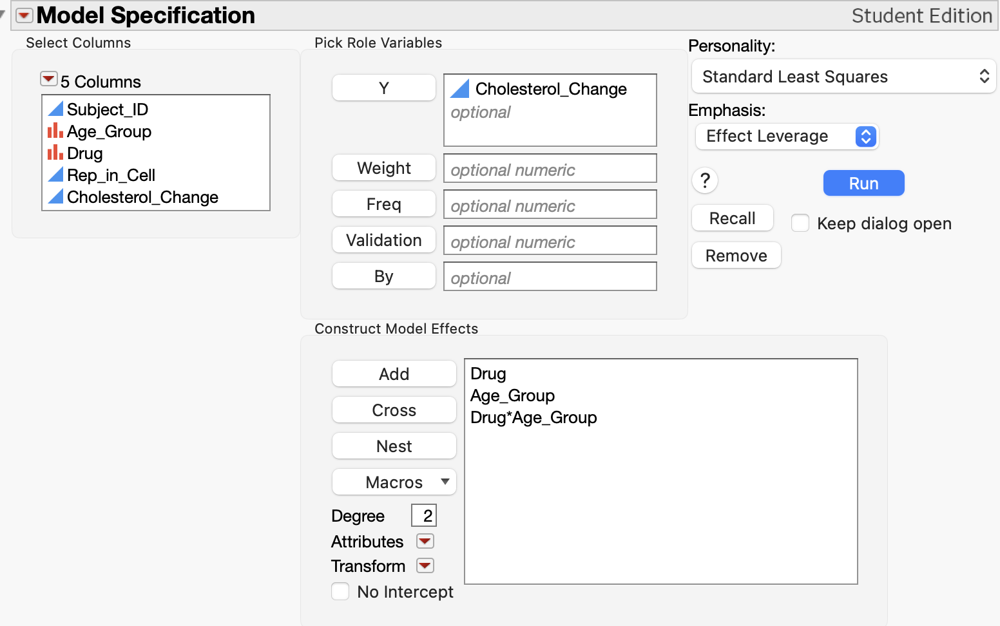
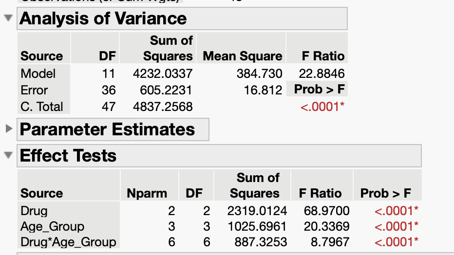
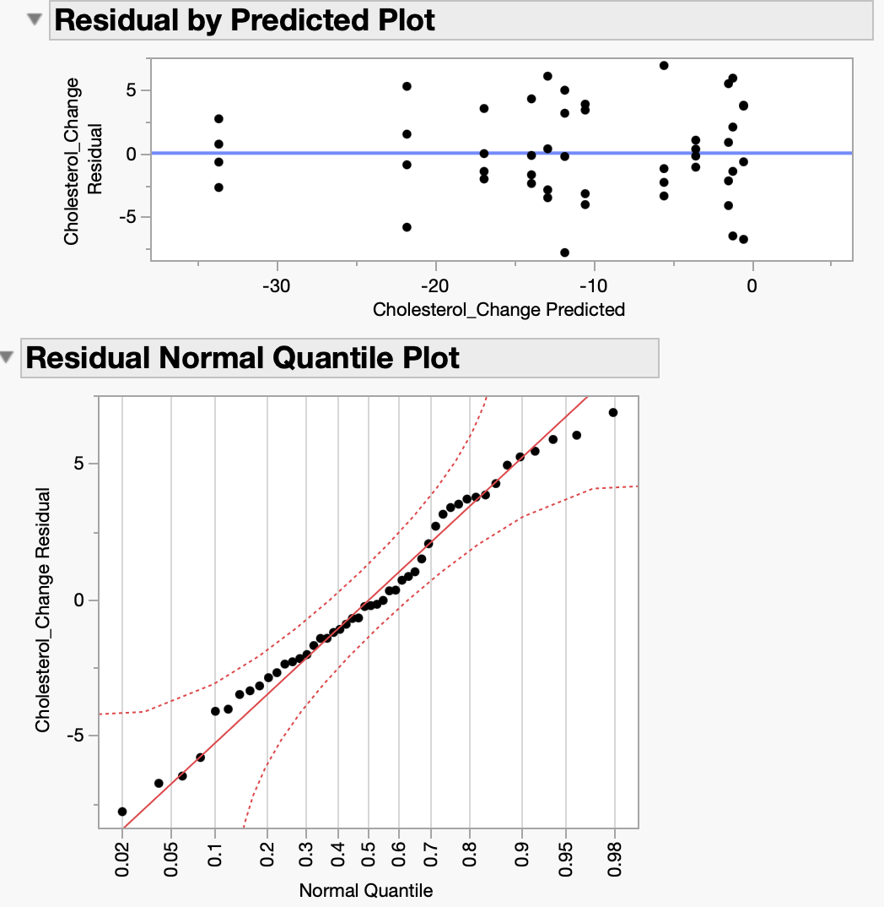
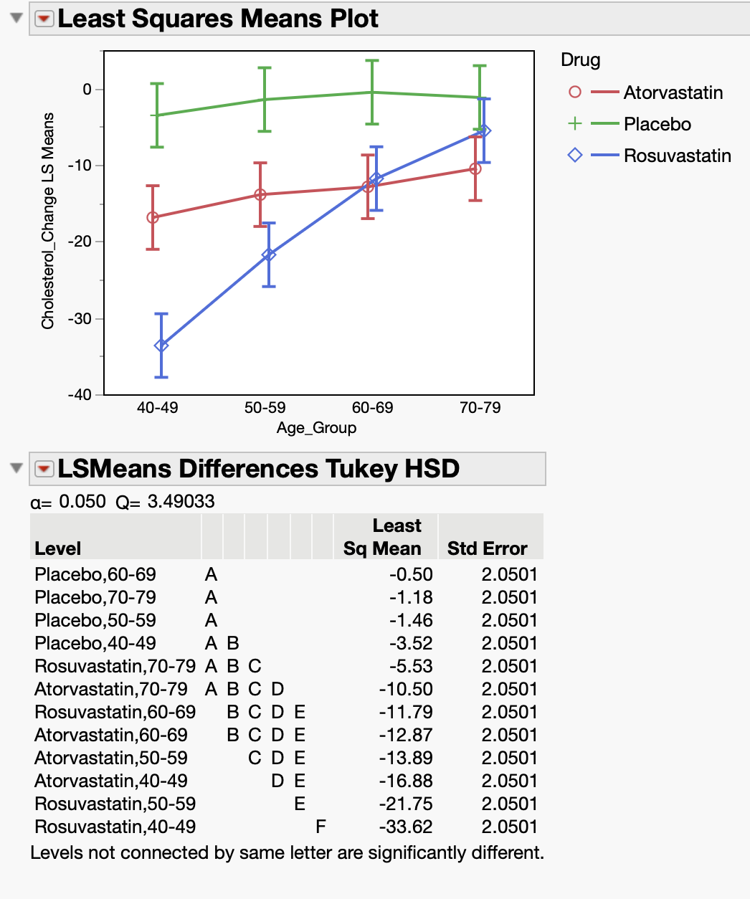
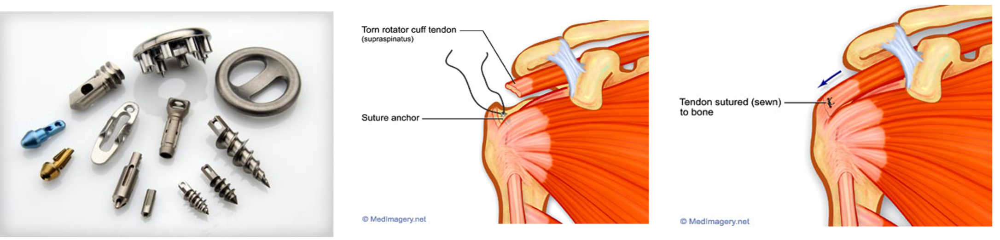

## Limitiations of RCBD

```{=html}
<style>
.reveal .slides .small table { font-size: 0.78em; line-height:1.05; }
.reveal .slides .small table th, .reveal .slides .small table td { padding:6px 8px; }
</style>
```

-   In an RCBD, each treatment appears *once* per block
    -   limits ability to test treatment x block interaction
-   Blocks reduce unexplained variability

What if...

-   One experimental unit per treatment x block isn't enough?
-   We want to assess the treatment x block interaction?
-   Blocks represent real populations (clinics, regions)?

## Example 7.1: Cholesterol

::: {style="font-size:0.7em"}
> Suppose we wish to compare three drugs (Placebo, Atorvastatin, Rosuvastatin) on their effectiveness at controlling cholesterol (change, post - pre) in adults. We decide to block on age group to reduce variability, using age ranges (40-49, 50-59, 60-69, 70-79).

As a RCBD, one adult in each age group is assigned each of the 3 drug treatments:

```{r}
#| fig-align: center
#| out-width: 80%
knitr::include_graphics("images/061-cholestoral-rcbd-blueprint.png")
```

-   Is one adult a good representation of all adults in that age range?
-   Can we tell if the drug works differently for older vs younger patients?
:::

## Solution: Replicate *within* block!

```{r}
#| fig-align: center
#| out-width: 80%
knitr::include_graphics("images/071-cholestoral-generalizedblock-blueprint.png")
```

::: callout-note
### Generalized Block Design

is used when we want or need to replicate within the block. This allows us to compare blocks while still accounting for block-to-block variation and assessing potential interactions between treatments and blocks.
:::

## Study Design

**Treatment Structure** One-way with three levels of drug (Placebo, Atorvastatin, Rosuvastatin); t = 3.

**Experimental Structure** Drug is randomly assigned to four adults (e.u.) within four age groups (40-49, 50-59, 60-69, 70-79) in a generalized block design for r = 16. The change in cholesterol (post - pre) is measured once for each adult (m.u.).

```{r}
#| echo: true
cholesterol_data <- read.csv("data/07-cholesterol.csv")
head(cholesterol_data)
```

## Incorrect Analysis

::: callout-warning
### Additive Model

$$y_{ij} = \mu + \tau_i + \rho_j + \epsilon_{ij}$$

```{r}
#| fig-align: center
#| out-width: 25%
#| echo: true
cholest_mod0 <- lm(Cholesterol_Change ~ Drug + Age_Group, data = cholesterol_data)
anova(cholest_mod0)
```

```{r}
#| fig-align: center
#| out-width: 60%
#| echo: true
#| output-location: column
plot(cholest_mod0, which = 1)
```
:::

## Include block x treatment interaction


::::: columns
::: column

::: {style="font-size:0.7em"}
$$y_{ijk} = \mu + \tau_i + \rho_j + \tau\rho_{ij} + \epsilon_{ij} \text{ with } \epsilon_{ijk} \text{ iid} \sim N(0, \sigma^2)$$ for $i = 1, 2, 3$, $j = 1, 2, 3, 4$, and $k = 1, 2, 3, 4.$
:::

:::

::: column
| Source of Variation | DF  |
|---------------------|-----|
|                     |     |
:::
:::::

## R: Include block x treatment interaction

:::: columns
::: column
```{r}
#| fig-align: center
#| out-width: 40%
#| echo: true
cholest_mod1 <- lm(Cholesterol_Change ~ Drug + Age_Group + Drug:Age_Group, 
                   data = cholesterol_data)
anova(cholest_mod1)
```
:::
::: column
```{r}
#| fig-align: center
#| out-width: 90%
#| echo: true
par(mfrow = c(1,2))
plot(cholest_mod1, which = 1:2)
```
:::
::::
## R: Example 7.1 Recommendations

:::: columns
::: column
```{r}
#| echo: true
#| fig-align: center
#| fig-width: 8
#| fig-height: 5
#| out-width: 80%
library(emmeans)
library(multcomp)
emmip(cholest_mod1, Drug ~ Age_Group, CI = T)
```
:::
::: column
```{r}
#| echo: true
emmeans(cholest_mod1, ~ Drug | Age_Group) |> 
  cld(Letters = LETTERS, decreasing = T, adjust = "tukey")
```
:::
::::

## JMP: Include block x treatment interaction

:::: columns
::: {.column width=33%}
```{r}
#| fig-align: center
#| out-width: 90%


```
:::
::: {.column width=33%}
```{r}
#| fig-align: center
#| out-width: 90%

```
:::
::: {.column width=33%}
```{r}
#| fig-align: center
#| out-width: 90%

```
:::
::::


## Generalized Block Design vs Full Factorial

-   Design: randomly assign treatments *within* blocks (kind of like a bunch of CRDs)
-   Analysis: essentially the same as a full factorial ($\tau_i + \rho_j + \tau_{ij}$)

## Misleading Main Effects (ignoring interaction)

:::: columns
::: column
```{r}
#| echo: true
#| fig-align: center
#| fig-width: 8
#| fig-height: 5
#| out-width: 80%
library(emmeans)
library(multcomp)
emmip(cholest_mod1, ~ Drug, CI = T)
```
:::
::: column
```{r}
#| echo: true
emmeans(cholest_mod1, ~ Drug) |> 
  cld(Letters = LETTERS, decreasing = T, adjust = "tukey")
```
:::
::::

<!-- ## Example 7.2: Bone Anchors -->

<!-- > An experiment was conducted to compare the pull-out forces of three bone anchors: two standard anchors (A1 and A2) and one experimental anchor (E). Because bone quality can influence anchor performance, two types of synthetic foam were used to simulate different bone densities: high-density (HD) and low-density (LD) foam. -->

<!-- > -->

<!-- > Each anchor was tested in both foam types, and 8 independent tests were conducted for every anchor-foam combination. This design allowed the researchers to compare anchors fairly under both bone-like conditions, while also accounting for variation due to foam type. -->

<!-- ```{r} -->

<!-- #| fig-align: center -->

<!-- #| out-width: 80% -->

<!--  -->

<!-- ``` -->

<!-- ## Example 7.1: Study Design -->

<!-- Would you want to treat form density as a fixed or random effect? -->
