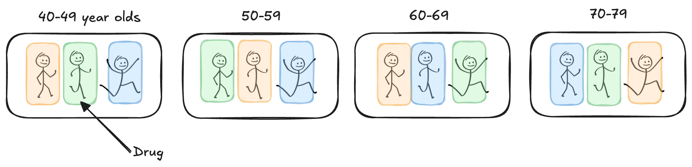
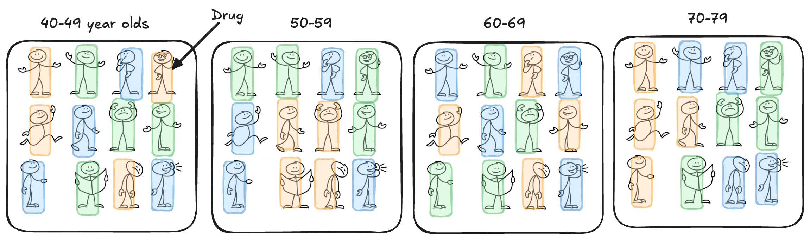

## Limitiations of RCBD

```{=html}
<style>
.reveal .slides .small table { font-size: 0.78em; line-height:1.05; }
.reveal .slides .small table th, .reveal .slides .small table td { padding:6px 8px; }
</style>
```

+ In an RCBD, each treatment appears *once* per block
  + limits ability to test treatment x block interaction
+ Blocks reduce unexplained variability

What if...

+ One experimental unit per treatment x block isn't enough?
+ We want to assess the treatment x block interaction?
+ Blocks represent real populations (clinics, regions)?

## Example 7.1: Cholesterol

::: {style="font-size:0.7em"}
Suppose we wish to compare three drugs (A, B, C) on their effectiveness at controlling cholesterol in adults. We decide to block on age group to reduce variability, using age ranges (40-49, 50-59, 60-69, 70-79).

As a RCBD, one adult in each age group is assigned each of the 3 drug treatments:

```{r}
#| fig-align: center
#| out-width: 80%

```

+ Is one adult a good representation of all adults in that age range?
+ Can we tell if the drug works differently for older vs younger patients?
:::

## Solution: Replicate *within* block!

```{r}
#| fig-align: center
#| out-width: 80%

```

::: callout-note
### Generalized Block Design
is used when we want or need to replicate within the block. This allows us to compare blocks while still accounting for block-to-block variation and assessing potential interactions between treatments and blocks.
:::


