## Why latin square designs?

```{=html}
<style>
.reveal .slides .small table { font-size: 0.78em; line-height:1.05; }
.reveal .slides .small table th, .reveal .slides .small table td { padding:6px 8px; }
</style>
```

::: {style="font-size:0.7em"}
-   RCBD blocks on one extraneous variable
-   Sometimes we need to account for two extraneous variables
-   Latin Square = rows + columns as blocks
:::

::: callout-note
### Field Design

```{r}
#| fig-align: center
#| out-width: 40%
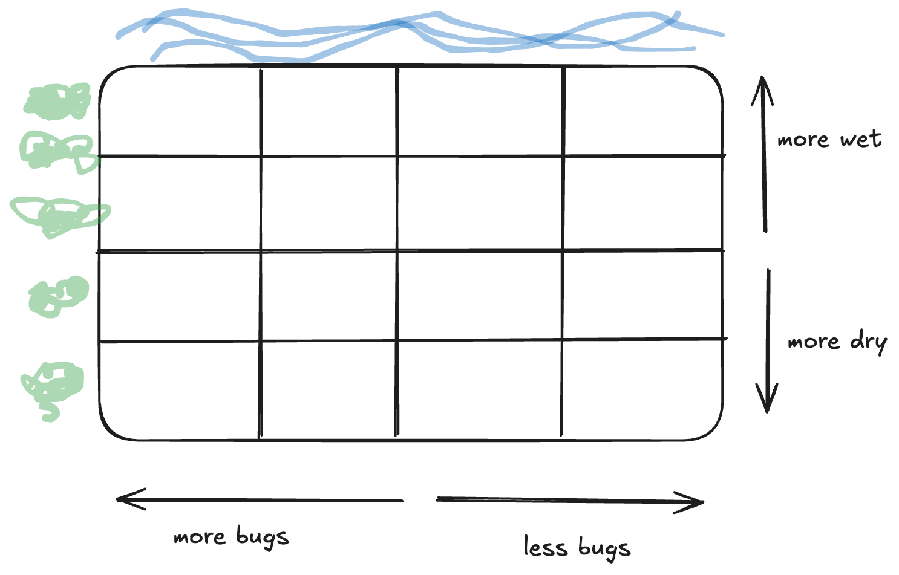
```
:::

## Example 7.2: Green Roof

::: {style="font-size:0.7em"}
> A MS student in Horticulture at Cal Poly, carried out a study on green
> roof technology. The purpose of the study was to investigate the
> effectiveness of 3 different growing media (Freedom Square, FLL
> standard and High Organic Matter) for establishing sedum on rooftops.
> (Sedum is a type of flowering succulent.) Lots of research in this
> area is being done, because planting on rooftops can help with storm
> water management, energy conservation and reduction of the surrounding
> air temperature. The response was the coverage % of sedum after a
> period of 8-weeks of growing time.
>
> The study was carried out in a replicated (3 reps) Latin Square on the
> platforms (shown below). The platforms must be set at an angle to help
> with drainage, but there were concerns that location within a platform
> would have an effect on growth, both in the N-S and E-W directions. So
> each platform was partitioned into a 3x3 grid as shown below
:::

```{r}
#| fig-align: center
#| out-width: 37%
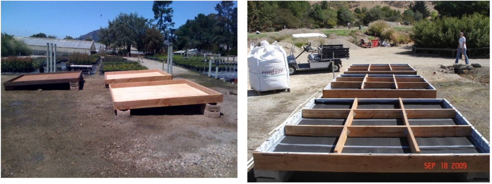
```

## Example 7.1: Green Roof

::::: columns
::: column
For one platform, identify..

-   Response variable:

-   Factor(s) & level(s):

-   Experimental unit:

-   Blocking variable 1:

-   Blocking variable 2:
:::

::: column
```{r}
#| fig-align: center
#| out-width: 80%
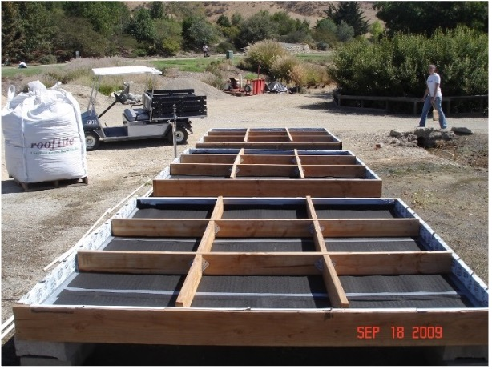
```
:::
:::::

## Latin Square Experimental Structure (Sudoku idea)

::::: columns
::: column
We implement a "restricted randomization"

If $t$ treatments

-   $t\times t$ grid
-   Each treatment appears *once* per row
-   and *once* per column
:::

::: column
```{r}
#| fig-align: center
#| out-width: 80%
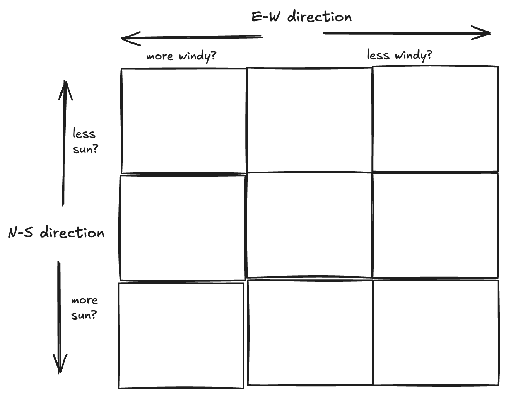
```
:::
:::::

## The Data: One Platform

```{r}
#| echo: true
library(tidyverse)
greenroof_data <- read_csv("data/07_green_roof_data.csv") |> 
  mutate(across(Platform_Replicate:Growing_Media, as.factor))

greenroof_data_platform1 <- greenroof_data |> 
  filter(Platform_Replicate == 1)
greenroof_data_platform1
```

## Statistical Effects Model (One Platform)

::: {style="font-size:0.7em"}
$$y_{ijk}=\mu + \tau_i + r_j + c_k + \epsilon_{ijk} \text{ with } \epsilon_{ijk} \text{ iid} \sim N(0,\sigma^2)$$

For $i=1,2,3;   j=1,2,3; k=1,2,3$

where:

-   $y_{ijk}$: % of sedum for the $k^{th}$ platform column (E-W) in the
    $j^{th}$ platform row (N-S) given the $i^{th}$ growing media. +
    $\mu$: overall mean % sedum
-   $\tau_i$: effect of the $i^{th}$ level of growing media
-   $r_j$: effect of the $j^{th}$ level of platform row (N-S direction)
-   $c_k$: effect of the $k^{th}$ level of platform column (E-W
    direction)
-   $\epsilon_{ijk}$: experimental error for the $k^{th}$ platform
    column (E-W) in the $j^{th}$ platform row (N-S) given the $i^{th}$
    growing media.
:::

## ANOVA (One Platform) {.small}

| Source of Variation              | DF               | SS    | MS    | F         |
|-------------------------|------------|------------|------------|------------|
| Rows\*                           | rows - 1         | SSrow | MSrow | MSrow/MSE |
| Columns\*                        | cols - 1         | SScol | MScol | MScol/MSE |
| Treatment                        | t - 1            | SSTrt | MSTrt | MSTrt/MSE |
| Rows x Cols x Treatments — error | Use subtraction! | SSE   | MSE   |           |
| Total                            | N - 1            |       |       |           |

\*Note: in only one Latin Square replicate, the number of row blocks and
column blocks are equal to the number of treatments (i.e., rows = cols =
t)

## Skeleton ANOVA (One Platform)

| Source of Variation | DF: 3 rows x 3 columns = 9 e.u - 1 = 8 total |
|---------------------|----------------------------------------------|
|                     |                                              |

## R: Analysis (One Platform)

::::: columns
::: column
```{r}
#| echo: true
greenroof_mod1 <- lm(Coverage_Pct ~ Growing_Media + NS_Position + EW_Position,
                     data = greenroof_data_platform1)
summary(greenroof_mod1)
```
:::

::: column
```{r}
#| echo: true
anova(greenroof_mod1)
```
:::
:::::

## JMP: Analysis (One Platform)

::::: columns
::: column
```{r}
#| fig-align: center
#| out-width: 90%
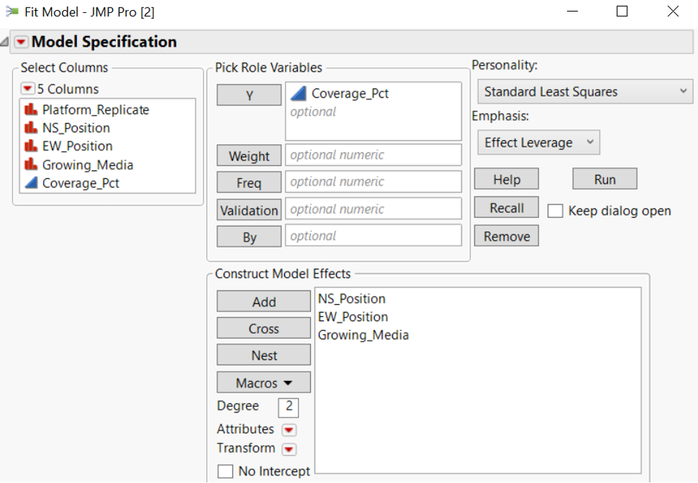
```
:::

::: column
```{r}
#| fig-align: center
#| out-width: 90%
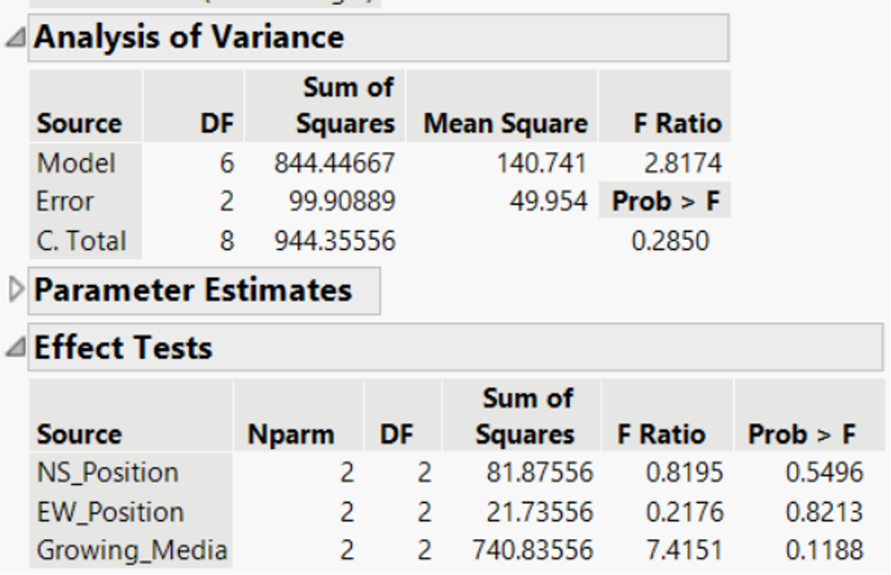
```
:::
:::::

## Replicating a Latin Square

::: callout-note
### Why Replicate?

Replication increases the error degrees of freedom, improving the
precision of estimates and increasing statistical power.

In a Latin Square design, replication can be achieved in several ways:

-   Replicate rows (e.g., adding more North-South blocks)
-   Replicate columns (e.g., adding more East-West blocks)
-   Replicate entire squares (e.g., adding more experimental platforms
    or study sites
:::

## Example 7.2: Replicated Latin Square Structure

::: {style="font-size:0.7em"}
Blocking to account for:

-   Platform = Global Block
-   N-S Direction *within* each Platform
-   E-W Direction *within* each Platform
:::

```{r}
#| fig-align: center
#| out-width: 100%
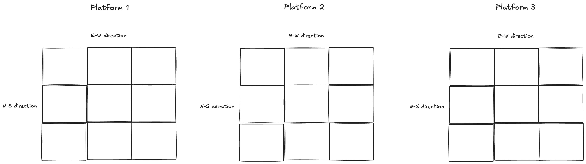
```


## Statistical Effects Model (Three Platforms)

::: {style="font-size:0.7em"}
$$y_{ijkl}=\mu+\tau_i+\rho_j+ r(\rho)_{jk}+c(\rho)_{jl}+\epsilon_{ijkl} \text{ with } \epsilon_{ijk} \text{ iid}\sim N(0,\sigma^2 )$$

For $i=1,2,3;   j=1,2,3;    k=1,2,3;    l=1,2,3$

where:

-   $y_{ijkl}$: % of sedum for the $j^{th}$ platform in the $l^{th}$
    platform column (E-W) in the $k^{th}$ platform row (N-S) given the
    $i^{th}$ growing media.
-   $\mu$: overall mean % sedum
-   $\tau_i$: effect of the $i^{th}$ level of growing media
-   $\rho_j$: effect of the $j^{th}$ platform
-   $r(\rho)_{jk}$: effect of the $k^{th}$ level of platform row (N-S
    direction) within the $j^{th}$ platform
-   $c(\rho)_{jl}$: effect of the $l^{th}$ level of platform column (E-W
    direction) within $j^{th}$ platform
-   $\epsilon_{ijkl}$: experimental error for the $j^{th}$ platform in
    the $l^{th}$ platform column (E-W) in the $k^{th}$ platform row
    (N-S) given the $i^{th}$ growing media.
:::

## ANOVA (Three Platforms) {.small}

| Source of Variation     | DF                   | SS    | MS    | F         |
|-------------------------|----------------------|-------|-------|-----------|
| Global Block            | blks - 1             | SSblk | MSblk | MSblk/MSE |
| Rows(Global Block)\*    | (rows - 1)(blks - 1) | SSrow | MSrow | MSrow/MSE |
| Columns(Global Block)\* | (cols - 1)(blks - 1) | SScol | MScol | MScol/MSE |
| Treatment               | t - 1                | SSTrt | MSTrt | MSTrt/MSE |
| Error                   | Use subtraction!     | SSE   | MSE   |           |
| Total                   | N - 1                |       |       |           |

## Skeleton ANOVA (Three Platforms)

| Source of Variation | DF: 3 rows x 3 columns = 9 e.u - 1 = 8 total |
|---------------------|----------------------------------------------|
|                     |                                              |

## R: Analysis (Three Platforms)

::::: columns
::: column
```{r}
#| echo: true
greenroof_mod2 <- lm(Coverage_Pct ~ Growing_Media + Platform_Replicate + 
                       Platform_Replicate/NS_Position + Platform_Replicate/EW_Position,
                     data = greenroof_data)
summary(greenroof_mod2)
```
:::

::: column
```{r}
#| echo: true
anova(greenroof_mod2)
```
:::
:::::

## JMP: Analysis (Three Platforms)

::::: columns
::: column
```{r}
#| fig-align: center
#| out-width: 90%
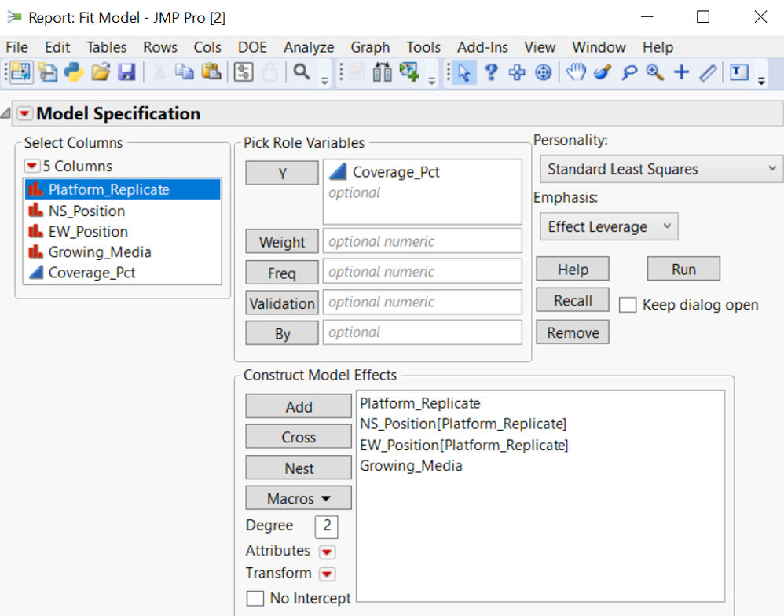
```
:::

::: column
```{r}
#| fig-align: center
#| out-width: 90%
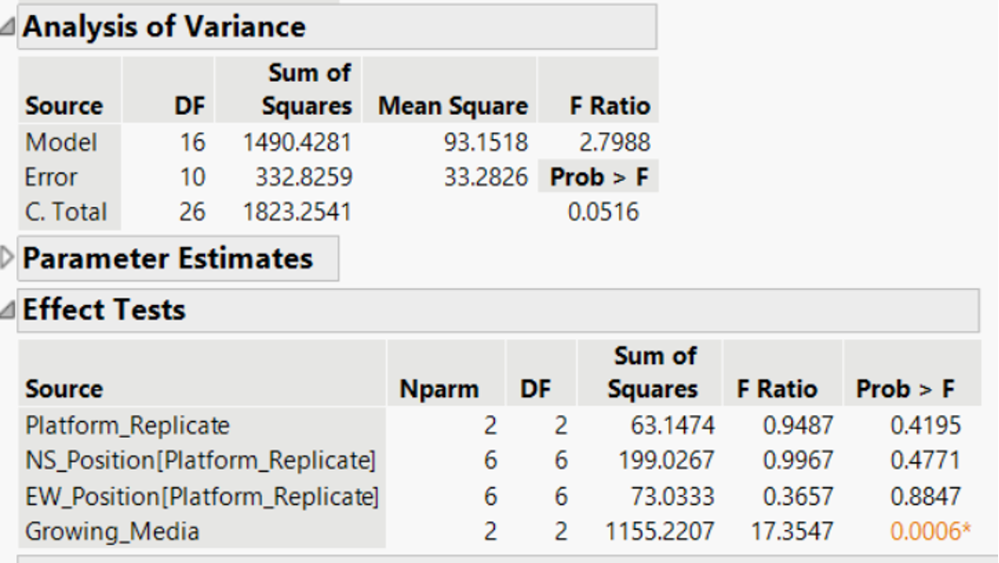
```
:::
:::::

## Results (Three Platforms)

::::: columns
::: {.column width=30%}
```{r}
#| fig-align: center
#| out-width: 90%
#| fig-height: 5
#| fig-width: 5
#| echo: true
library(emmeans)
library(multcomp)
emmip(greenroof_mod2, ~ Growing_Media, 
      CI = T)
```

:::
::: {.column width=37%}

```{r}
#| fig-align: center
#| out-width: 90%
#| fig-height: 5
#| fig-width: 8
#| echo: true
emmeans(greenroof_mod2, ~ Growing_Media) |> 
  cld(Letters = LETTERS, 
      decreasing = T, 
      adjust = "tukey")
```
:::

::: {.column width=33%}
```{r}
#| fig-align: center
#| out-width: 90%
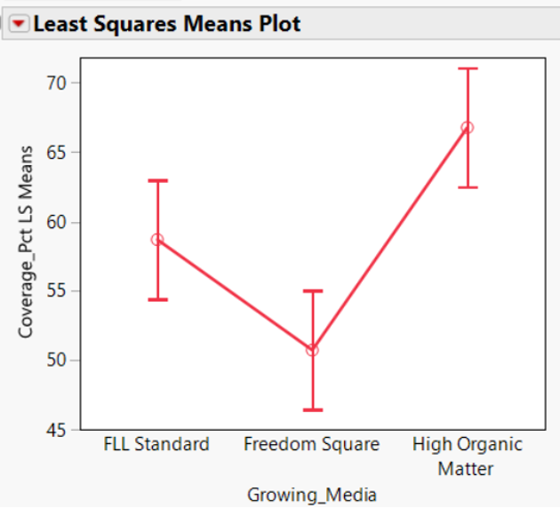
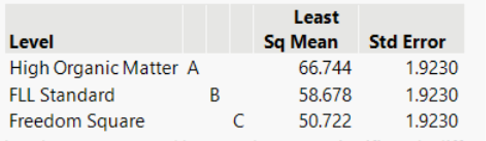
```
:::
:::::

## Random Effects in a Latin Square

Treat blocks as random when:

+ blocks represent a larger population
+ you don’t care about specific blocks
+ you want broader inference

## Crossover Designs

::: callout-note
Crossover designs are one of the most common *applications* of Latin Square experimental structures. In these designs, each subject receives multiple treatments over different time periods, serving as their own block.

+ Repeated Measures Structure: Each subject is exposed to multiple treatments.
+ Latin Square Application: A structured way to balance treatment order across subjects.
+ Washout Periods: Time between treatments to eliminate carryover effects.
+ Multiple Subjects Per Sequence: Ensures treatment comparisons are not biased by order effects.
:::

## Example 7.3: Clinical Trial

::: {style="font-size:0.7em"}

> Suppose we have 2 medications (new medication, N vs. standard medication, S). Patients are recruited (100 patients) into the study. Each patient receives one of the medications for the first period of time. Then, each patient, crosses over to the other medication during a second time period. Patients are randomly assigned to one of the possible sequences: NS or SN
> 
> Typically, there will be a washout period between the treatments so that medication that was assigned in the first time period has time to clear out of the patient’s body before they begin on the second medication.
:::


```{r}
#| fig-align: center
#| out-width: 70%
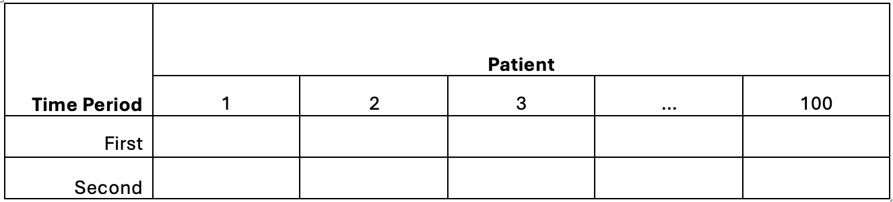
```

## Key Conditions for a Crossover

:::: columns
::: column
Works best when:

+ condition is chronic/stable
+ treatment is not curative
+ washout removes carryover
:::
::: column
Threats:

+ short washout period leading to carryover effects
+ period effects
+ treatment alters future response
:::
::::

