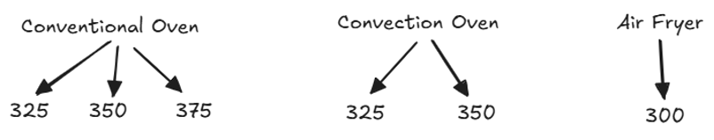
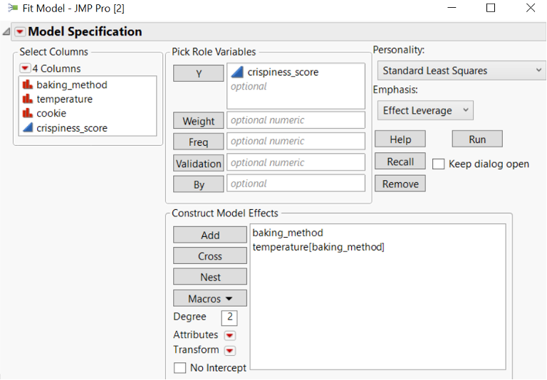
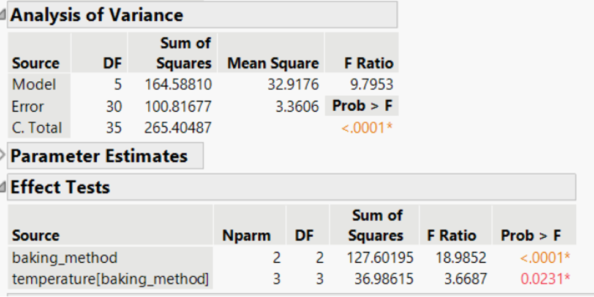
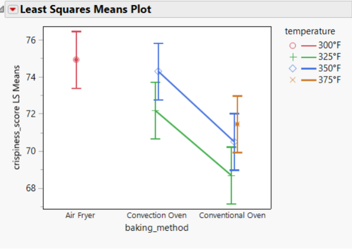
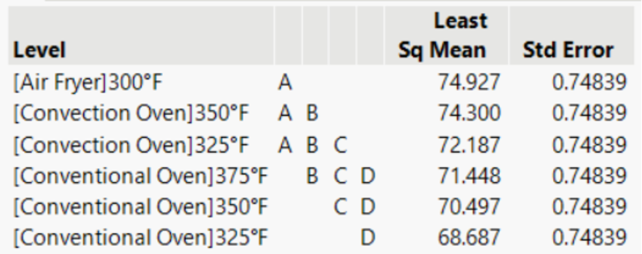

## Crossed vs Nested Treatment Structure

```{=html}
<style>
.reveal .slides .small table { font-size: 0.78em; line-height:1.05; }
.reveal .slides .small table th, .reveal .slides .small table td { padding:6px 8px; }
</style>
```

**Crossed/Full Factorial**

Each level of factor B appears with every level of Factor A

**Nested**

Levels of facotr B are unique within each level of Factor A

## Example 7.4: Cookies in Air Fryers

::: {style="font-size:0.7em"}
> Baking is a precise science, and small changes in baking methods can have a significant impact on the final texture of cookies. A food scientist is conducting an experiment to determine how different baking methods influence cookie crispiness. However, not all baking methods allow for the same range of baking temperatures. For example, a conventional oven can accommodate a wider range of temperatures than an air fryer, which operates at lower heat settings. The food scientist bakes 6 cookies at each of the method and temperature combinations.

```{r}
#| fig-align: center
#| out-width: 70%

```

Therefore, we do not consider the main effect of Temperature. Instead, we will consider the individual effects of each Temperature within each Baking Method.
:::

## Statistical Effects Model for Nested Treatment Structures

::: {style="font-size:0.7em"}
$$y_{ijk} = \mu + \alpha_i + \beta(\alpha)_{ij} + \epsilon_{ijk} \text{ with } \epsilon_{ijk} \text{ iid} \sim N(0,\sigma^2)$$
for $i=1,2,3;  j=1,2,…b_i; k= 1,2,3,4,5,6$

where:

-   $y_{ijk}$: the crispiness of the $k^{th}$ cookie baked at the $j^{th}$ temperature in the $i^{th}$ baking method.
-   $\alpha_i$: the effect of the $i^{th}$ baking method
-   $\beta(\alpha)_{ij}$: the effect of the $j^{th}$ temperature nested within the $i^{th}$ baking method
-   $\epsilon_{ijk}$∶ the experimental error for the $k^{th}$ cookie baked at the $j^{th}$ temperature in the $i^{th}$ baking method.
:::

## ANOVA Table  {.small}

| SV               | DF              | SS     | MS     | F          |
|------------------|-----------------|--------|--------|------------|
| A                | (a-1)           | SSA    | MSA    | MSA/MSE    |
| B(A)             | use subtraction | SSB(A) | MSB(A) | MSB(A)/MSE |
| e.u.(AB) - error | use subtraction | SSE    | MSE    |            |
| Total            | N-1             |        |        |            |

## Skeleton ANOVA

| Source of Variation | DF  |
|---------------------|-----|
|                     |     |

## R: Analysis

```{r}
#| echo: true
library(tidyverse)
cookie_data <- read_csv("data/07_cookie_data.csv") |> 
  mutate(across(baking_method:cookie, as.factor))
head(cookie_data)

cookie_mod <- lm(crispiness_score ~ baking_method + baking_method/temperature,
                 data = cookie_data)
anova(cookie_mod)
```

## JMP: Analysis

::::: columns
::: column
```{r}
#| fig-align: center
#| out-width: 80%

```
:::

::: column
```{r}
#| fig-align: center
#| out-width: 80%

```
:::
:::::

## R: Results

::::: columns
::: {.column width=50%}
```{r}
#| echo: true
#| fig-align: center
#| out-width: 80%
#| fig-width: 8
#| fig-height: 5
library(emmeans)
library(multcomp)
emmip(cookie_mod, baking_method ~ temperature, 
      CIs = TRUE)
```
:::
::: {.column width=50%}
```{r}
#| echo: true
emmeans(cookie_mod, specs = ~ baking_method:temperature) |> 
  cld(Letters = LETTERS, decreasing = TRUE, adjust = "tukey")
```
:::
::::

## JMP: Results

:::: columns
::: {.column width=50%}
```{r}
#| fig-align: center
#| out-width: 90%

```
:::
::: {.column width=50%}
```{r}
#| fig-align: center
#| out-width: 90%

```
:::
:::::
